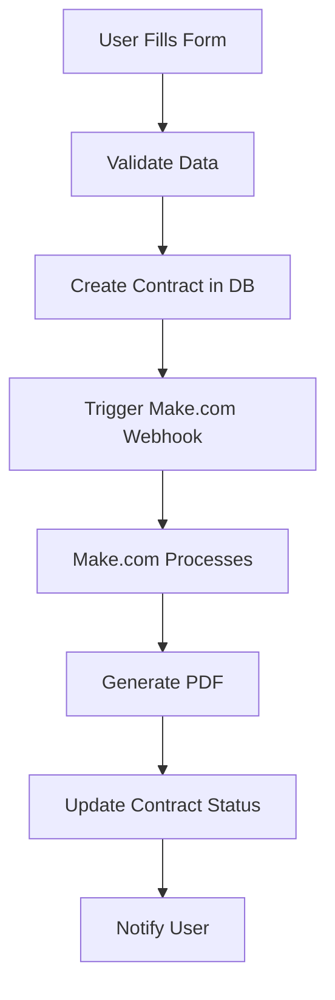

# 🏢 General Contract Generation System

## 📋 Overview

The General Contract Generation System is a comprehensive solution for creating professional general contracts with automated processing via Make.com integration. This system supports various contract types including service contracts, consulting agreements, partnership agreements, and more.

## 🎯 Features

### ✅ Core Features
- **Multi-Contract Type Support**: 10+ different contract types
- **Automated PDF Generation**: Via Make.com integration
- **Real-time Form Validation**: Client-side and server-side validation
- **Auto-save Functionality**: Draft preservation in localStorage
- **Party Management**: Integration with promoters, clients, and employers
- **Template System**: Google Docs template integration
- **Image Processing**: ID card and passport image handling
- **Status Tracking**: Real-time contract status updates

### 🎨 UI/UX Features
- **Responsive Design**: Mobile-first approach
- **Modern Interface**: Clean, professional design
- **Progress Indicators**: Visual feedback during generation
- **Error Handling**: Comprehensive error messages
- **Success Notifications**: Toast notifications for user feedback
- **Form Persistence**: Auto-save and restore functionality

## 🏗️ Architecture

### Frontend Components
```
components/
├── GeneralContractGenerator.tsx    # Main UI component
└── ui/                            # Reusable UI components
    ├── button.tsx
    ├── card.tsx
    ├── input.tsx
    ├── select.tsx
    └── textarea.tsx
```

### Backend Services
```
lib/
├── general-contract-service.ts    # Core business logic
└── supabase/                      # Database client
    └── server.ts
```

### API Endpoints
```
app/api/
├── contracts/general/generate/     # Contract creation
├── webhook/makecom-general/        # Make.com webhook
└── webhook/contract-pdf-ready-general/ # PDF ready callback
```

## 📊 Contract Types Supported

| Contract Type | Description | Use Case |
|---------------|-------------|----------|
| `general-service` | General Service Contract | Standard service agreements |
| `consulting-agreement` | Consulting Agreement | Professional consulting services |
| `service-contract` | Service Contract | Specific service delivery |
| `partnership-agreement` | Partnership Agreement | Business partnerships |
| `vendor-agreement` | Vendor Agreement | Supplier relationships |
| `maintenance-contract` | Maintenance Contract | Equipment maintenance |
| `supply-agreement` | Supply Agreement | Product supply |
| `distribution-agreement` | Distribution Agreement | Product distribution |
| `franchise-agreement` | Franchise Agreement | Franchise operations |
| `licensing-agreement` | Licensing Agreement | Intellectual property licensing |

## 🔄 Make.com Integration Flow

### 1. Contract Creation Flow


### 2. Make.com Scenario Structure
Based on the provided Make.com flow:

1. **Webhook Trigger** (Module 1)
   - Receives contract data
   - Validates required fields

2. **Variable Setting** (Modules 53-55)
   - Sets contract_id, contract_number
   - Stores all contract data in variables

3. **Data Retrieval** (Modules 57-59)
   - Fetches promoter data from Supabase
   - Fetches first party (client) data
   - Fetches second party (employer) data

4. **Template Processing** (Modules 4-5)
   - Gets Google Docs template
   - Prepares template content

5. **Document Creation** (Module 56)
   - Creates document from template
   - Maps all variables and images
   - Saves to Google Drive

6. **PDF Export** (Module 8)
   - Exports document as PDF
   - Saves to Google Drive

7. **File Upload** (Module 9)
   - Uploads PDF to Supabase storage
   - Updates file metadata

8. **Status Update** (Modules 10-11)
   - Calls back to update contract status
   - Responds to webhook

## 🛠️ Setup Instructions

### 1. Environment Variables
```env
# Make.com Integration
MAKECOM_WEBHOOK_URL=https://hook.eu2.make.com/your-webhook-url
MAKE_WEBHOOK_SECRET=your-webhook-secret
PDF_WEBHOOK_SECRET=your-pdf-webhook-secret

# Supabase
NEXT_PUBLIC_SUPABASE_URL=your-supabase-url
NEXT_PUBLIC_SUPABASE_ANON_KEY=your-supabase-anon-key
SUPABASE_SERVICE_ROLE_KEY=your-service-role-key
```

### 2. Make.com Scenario Setup

#### Step 1: Create Webhook Trigger
1. Go to Make.com
2. Create new scenario
3. Add "Custom Webhook" trigger
4. Copy webhook URL to `MAKECOM_WEBHOOK_URL`

#### Step 2: Configure Modules
Use the provided Make.com flow JSON to set up all modules:
- Webhook trigger
- Variable setting modules
- Supabase data retrieval
- Google Docs template processing
- PDF generation and upload
- Status update callbacks

#### Step 3: Set Template IDs
Update these template IDs in your Make.com scenario:
- **General Contract Template**: `1b1YNKbaP6JID7s8vDDZLok3nY87W_H_DNWX__N7XwOA`
- **Google Drive Folder**: `/1WoJfPb62ILAKaMT1jEjXH3zwjfkXmg3a/1v8x-WIRVpYdIoO72LVTKpePB5z-bjOep/1qjY2Jjn9BkzlckqolWCTS64k-y6zIeBw`

### 3. Database Setup
Ensure your Supabase database has these tables:
- `contracts` - Main contract storage
- `promoters` - Promoter information
- `parties` - Client and employer data
- `contracts_storage` - File storage bucket

## 📱 Usage Guide

### 1. Access the Interface
Navigate to `/contracts/general` to access the General Contract Generator.

### 2. Fill Contract Details
1. **Select Parties**: Choose promoter, client, and employer
2. **Contract Details**: Fill in job title, department, location, salary
3. **General Contract Fields**: Add product/service specific information
4. **Terms & Conditions**: Include special terms, payment terms, etc.

### 3. Generate Contract
Click "Generate General Contract" to:
- Create contract in database
- Trigger Make.com automation
- Generate professional PDF
- Update contract status

### 4. Monitor Progress
- Real-time status updates
- Email notifications (if configured)
- Contract tracking in dashboard

## 🔧 API Reference

### Create General Contract
```http
POST /api/contracts/general/generate
Content-Type: application/json

{
  "contract_type": "general-service",
  "promoter_id": "uuid",
  "first_party_id": "uuid",
  "second_party_id": "uuid",
  "job_title": "Software Engineer",
  "department": "IT",
  "work_location": "Muscat, Oman",
  "basic_salary": 1000,
  "contract_start_date": "2025-01-01",
  "contract_end_date": "2025-12-31",
  "product_name": "Software Development",
  "service_description": "Custom software development services",
  "payment_terms": "Net 30 days"
}
```

### Make.com Webhook
```http
POST /api/webhook/makecom-general
Content-Type: application/json
X-Webhook-Secret: your-secret

{
  "contract_type": "general-service",
  "promoter_id": "uuid",
  "first_party_id": "uuid",
  "second_party_id": "uuid",
  // ... other contract data
}
```

### PDF Ready Callback
```http
PATCH /api/webhook/contract-pdf-ready-general
Content-Type: application/json
X-Webhook-Secret: your-pdf-secret

{
  "contract_id": "uuid",
  "contract_number": "GEN-01012025-ABCD",
  "pdf_url": "https://storage.url/contract.pdf",
  "google_drive_url": "https://docs.google.com/document/d/...",
  "status": "completed"
}
```

## 🧪 Testing

### 1. Unit Tests
```bash
npm test -- --testPathPattern=general-contract
```

### 2. Integration Tests
```bash
npm run test:integration
```

### 3. Manual Testing
1. Create test contract via UI
2. Verify database entry
3. Check Make.com webhook trigger
4. Validate PDF generation
5. Confirm status updates

## 🚀 Deployment

### 1. Build Application
```bash
npm run build
```

### 2. Deploy to Production
```bash
npm run deploy
```

### 3. Verify Environment Variables
Ensure all required environment variables are set in production.

### 4. Test Make.com Integration
Run end-to-end test to verify Make.com webhook integration.

## 📈 Monitoring & Analytics

### 1. Contract Generation Metrics
- Success rate
- Average processing time
- Error rates by contract type

### 2. Make.com Performance
- Webhook response times
- PDF generation success rate
- Template processing efficiency

### 3. User Experience
- Form completion rates
- Error frequency
- User satisfaction scores

## 🔒 Security Considerations

### 1. Webhook Security
- Secret verification for all webhooks
- Rate limiting on API endpoints
- Input validation and sanitization

### 2. Data Protection
- Encrypted data transmission
- Secure file storage
- Access control and permissions

### 3. Audit Trail
- Contract creation logs
- Status change tracking
- User action logging

## 🐛 Troubleshooting

### Common Issues

#### 1. Make.com Webhook Not Triggering
- Check `MAKECOM_WEBHOOK_URL` environment variable
- Verify webhook secret configuration
- Check Make.com scenario status

#### 2. PDF Generation Fails
- Verify Google Docs template access
- Check template ID configuration
- Validate image URLs

#### 3. Database Errors
- Check Supabase connection
- Verify table permissions
- Review data validation

### Debug Mode
Enable debug logging by setting:
```env
DEBUG=general-contract:*
```

## 📞 Support

For technical support or questions:
- **Documentation**: Check this file and inline code comments
- **Issues**: Create GitHub issue with detailed description
- **Contact**: Reach out to development team

## 🔄 Updates & Maintenance

### Regular Maintenance
- Update Make.com templates
- Review and update contract types
- Monitor performance metrics
- Security updates and patches

### Version History
- **v1.0.0**: Initial release with basic functionality
- **v1.1.0**: Added advanced contract types
- **v1.2.0**: Enhanced Make.com integration
- **v1.3.0**: Improved UI/UX and error handling

---

## 📝 Notes

This system is designed to be:
- **Scalable**: Handle high volume of contract generation
- **Reliable**: Robust error handling and recovery
- **User-friendly**: Intuitive interface and clear feedback
- **Maintainable**: Well-documented and modular code
- **Secure**: Comprehensive security measures

The integration with Make.com provides powerful automation capabilities while maintaining flexibility for different contract types and requirements.
