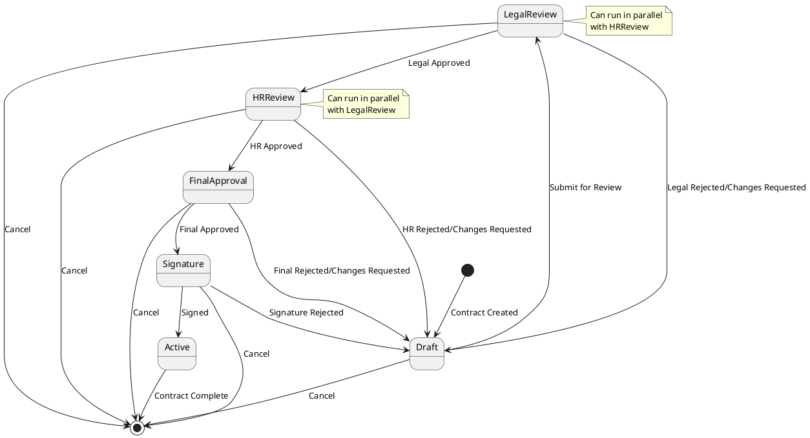

# Contract Management System - Approval Workflow Enhancement

## Background

The existing Contract Management System provides automated generation of employment contracts through Google Docs and Make.com integrations. While users can create, process, and generate final PDF contracts, the current workflow stops at generation with a simple set of statuses (`Draft → Processing → Generated → Failed`). There is no formal review or approval process, which introduces legal and compliance risks for the organization when contracts are issued without proper oversight.

To meet business and regulatory requirements, we need to implement a structured approval workflow. This will ensure that each contract draft passes through designated reviewers (Legal, HR, Final) before reaching the signature stage. The new workflow will leverage existing infrastructure (Supabase tables, user roles, notifications) while adding approval-specific components, audit trails, and conditional routing rules.

## Requirements

### Must-Have

* **Draft Submission**: Users must be able to submit a drafted contract for review.
* **Review Stages**: Support at least five sequential stages: Draft → Legal Review → HR Review → Final Approval → Signature → Active.
* **Role-Based Access**: Define and enforce reviewer roles (`legal_reviewer`, `hr_reviewer`, `final_approver`, `signatory`).
* **Approval Records**: Persist each approval decision and comments in an audit table (`contract_approvals`).
* **Notifications**: Trigger email/Slack alerts for pending reviews and overdue tasks.
* **Audit Trail**: Maintain a complete history of state changes, timestamps, and reviewer identities.

### Should-Have

* **Parallel Reviews**: Allow Legal and HR reviews to occur in parallel for efficiency.
* **Conditional Routing**: Route to different reviewers based on contract type or contract value thresholds.
* **Role Configurability**: Allow administrators to assign or change reviewer roles via the UI.

### Could-Have

* **Escalation Rules**: Auto-escalate pending reviews after configurable timeouts.
* **Batch Actions**: Let reviewers approve or reject multiple contracts at once.

### Won't-Have (for MVP)

* Integration with external BPM engines (e.g., Camunda).
* AI-driven risk scoring or clause suggestion.
* Mobile-specific UI; desktop web only initially.

## Method

### Database Schema Changes

#### 1. Update `contracts` table
```sql
-- Add approval workflow fields to existing contracts table
ALTER TABLE contracts 
ADD COLUMN approval_status VARCHAR(50) DEFAULT 'draft' CHECK (approval_status IN ('draft', 'legal_review', 'hr_review', 'final_approval', 'signature', 'active', 'rejected')),
ADD COLUMN current_reviewer_id UUID REFERENCES users(id),
ADD COLUMN submitted_for_review_at TIMESTAMP WITH TIME ZONE,
ADD COLUMN approved_at TIMESTAMP WITH TIME ZONE,
ADD COLUMN rejected_at TIMESTAMP WITH TIME ZONE,
ADD COLUMN rejection_reason TEXT;

-- Add indexes for performance
CREATE INDEX idx_contracts_approval_status ON contracts(approval_status);
CREATE INDEX idx_contracts_current_reviewer ON contracts(current_reviewer_id);
CREATE INDEX idx_contracts_submitted_at ON contracts(submitted_for_review_at);
```

#### 2. Create `contract_approvals` table
```sql
CREATE TABLE contract_approvals (
    id UUID PRIMARY KEY DEFAULT gen_random_uuid(),
    contract_id UUID NOT NULL REFERENCES contracts(id) ON DELETE CASCADE,
    reviewer_id UUID NOT NULL REFERENCES users(id),
    review_stage VARCHAR(50) NOT NULL CHECK (review_stage IN ('legal_review', 'hr_review', 'final_approval', 'signature')),
    action VARCHAR(20) NOT NULL CHECK (action IN ('approved', 'rejected', 'requested_changes')),
    comments TEXT,
    reviewed_at TIMESTAMP WITH TIME ZONE DEFAULT NOW(),
    created_at TIMESTAMP WITH TIME ZONE DEFAULT NOW(),
    
    -- Ensure one approval per reviewer per stage per contract
    UNIQUE(contract_id, reviewer_id, review_stage)
);

-- Add indexes
CREATE INDEX idx_contract_approvals_contract_id ON contract_approvals(contract_id);
CREATE INDEX idx_contract_approvals_reviewer_id ON contract_approvals(reviewer_id);
CREATE INDEX idx_contract_approvals_stage ON contract_approvals(review_stage);
```

#### 3. Create `reviewer_roles` table
```sql
CREATE TABLE reviewer_roles (
    id UUID PRIMARY KEY DEFAULT gen_random_uuid(),
    user_id UUID NOT NULL REFERENCES users(id) ON DELETE CASCADE,
    role_type VARCHAR(50) NOT NULL CHECK (role_type IN ('legal_reviewer', 'hr_reviewer', 'final_approver', 'signatory')),
    is_active BOOLEAN DEFAULT true,
    assigned_by UUID REFERENCES users(id),
    assigned_at TIMESTAMP WITH TIME ZONE DEFAULT NOW(),
    created_at TIMESTAMP WITH TIME ZONE DEFAULT NOW(),
    
    -- Ensure one active role per user per type
    UNIQUE(user_id, role_type)
);

-- Add indexes
CREATE INDEX idx_reviewer_roles_user_id ON reviewer_roles(user_id);
CREATE INDEX idx_reviewer_roles_type ON reviewer_roles(role_type);
CREATE INDEX idx_reviewer_roles_active ON reviewer_roles(is_active);
```

#### 4. Create `workflow_config` table
```sql
CREATE TABLE workflow_config (
    id UUID PRIMARY KEY DEFAULT gen_random_uuid(),
    config_name VARCHAR(100) NOT NULL UNIQUE,
    config_type VARCHAR(50) NOT NULL CHECK (config_type IN ('routing_rules', 'escalation_rules', 'notification_rules')),
    config_data JSONB NOT NULL,
    is_active BOOLEAN DEFAULT true,
    created_by UUID REFERENCES users(id),
    created_at TIMESTAMP WITH TIME ZONE DEFAULT NOW(),
    updated_at TIMESTAMP WITH TIME ZONE DEFAULT NOW()
);

-- Add indexes
CREATE INDEX idx_workflow_config_type ON workflow_config(config_type);
CREATE INDEX idx_workflow_config_active ON workflow_config(is_active);
```

### Workflow State Machine



### API Endpoints

#### 1. Contract Submission
```typescript
POST /api/contracts/{contractId}/submit-for-review
{
  "reviewers": {
    "legal_reviewer_id": "uuid",
    "hr_reviewer_id": "uuid",
    "final_approver_id": "uuid"
  },
  "priority": "normal" | "urgent",
  "notes": "string"
}

Response:
{
  "success": true,
  "contract_id": "uuid",
  "approval_status": "legal_review",
  "current_reviewer_id": "uuid",
  "submitted_at": "timestamp"
}
```

#### 2. Approval Actions
```typescript
POST /api/contracts/{contractId}/approve
{
  "action": "approved" | "rejected" | "requested_changes",
  "comments": "string",
  "next_reviewer_id": "uuid" // optional, for routing
}

Response:
{
  "success": true,
  "approval_id": "uuid",
  "new_status": "hr_review",
  "next_reviewer_id": "uuid"
}
```

#### 3. Get Pending Reviews
```typescript
GET /api/reviews/pending?role=legal_reviewer&status=active

Response:
{
  "reviews": [
    {
      "contract_id": "uuid",
      "contract_number": "PAC-23072024-0001",
      "contract_name": "Employment Contract",
      "submitted_at": "timestamp",
      "days_pending": 3,
      "priority": "urgent"
    }
  ]
}
```

#### 4. Workflow Configuration
```typescript
GET /api/workflow/config
POST /api/workflow/config
PUT /api/workflow/config/{configId}

{
  "routing_rules": {
    "contract_value_threshold": 50000,
    "high_value_reviewers": ["uuid1", "uuid2"],
    "parallel_reviews": true
  },
  "escalation_rules": {
    "legal_review_timeout_days": 3,
    "hr_review_timeout_days": 2,
    "escalation_recipients": ["uuid1"]
  }
}
```

### Frontend Components

#### 1. Contract Approval Dashboard
```typescript
// components/approval/ApprovalDashboard.tsx
interface ApprovalDashboardProps {
  userRole: 'legal_reviewer' | 'hr_reviewer' | 'final_approver' | 'signatory';
  pendingReviews: ContractReview[];
  completedReviews: ContractReview[];
}

// Features:
// - List of pending reviews with priority indicators
// - Quick approve/reject actions
// - Filter by contract type, date range, priority
// - Bulk actions for multiple contracts
```

#### 2. Contract Review Form
```typescript
// components/approval/ContractReviewForm.tsx
interface ContractReviewFormProps {
  contractId: string;
  reviewStage: string;
  onApprove: (comments: string) => void;
  onReject: (reason: string) => void;
  onRequestChanges: (changes: string) => void;
}

// Features:
// - Contract details display
// - Approval/rejection form
// - Comments and notes section
// - File attachments for supporting documents
```

#### 3. Workflow Status Tracker
```typescript
// components/approval/WorkflowStatusTracker.tsx
interface WorkflowStatusTrackerProps {
  contractId: string;
  currentStatus: string;
  approvalHistory: ApprovalRecord[];
}

// Features:
// - Visual workflow progress indicator
// - Timeline of approval events
// - Reviewer information and timestamps
// - Status change notifications
```

### Notification System

#### 1. Email Notifications
```typescript
// lib/notifications/approval-notifications.ts
export class ApprovalNotificationService {
  static async notifyReviewer(contractId: string, reviewerId: string): Promise<void>;
  static async notifyApprovalComplete(contractId: string): Promise<void>;
  static async notifyEscalation(contractId: string, escalatedTo: string[]): Promise<void>;
  static async notifyOverdue(contractId: string, reviewerId: string): Promise<void>;
}
```

#### 2. Slack Integration
```typescript
// lib/notifications/slack-notifications.ts
export class SlackApprovalNotifications {
  static async sendReviewRequest(contract: Contract, reviewer: User): Promise<void>;
  static async sendApprovalUpdate(contract: Contract, approval: ApprovalRecord): Promise<void>;
  static async sendEscalationAlert(contract: Contract, daysOverdue: number): Promise<void>;
}
```

### Security & Permissions

#### 1. Row Level Security (RLS) Policies
```sql
-- Contract visibility based on role
CREATE POLICY "Users can view contracts they created or are reviewing" ON contracts
FOR SELECT USING (
  created_by = auth.uid() OR 
  current_reviewer_id = auth.uid() OR
  EXISTS (
    SELECT 1 FROM reviewer_roles 
    WHERE user_id = auth.uid() AND is_active = true
  )
);

-- Approval actions based on role
CREATE POLICY "Reviewers can approve contracts in their stage" ON contract_approvals
FOR INSERT WITH CHECK (
  EXISTS (
    SELECT 1 FROM reviewer_roles 
    WHERE user_id = auth.uid() 
    AND role_type = review_stage 
    AND is_active = true
  )
);
```

#### 2. Role-Based Access Control
```typescript
// lib/auth/approval-permissions.ts
export const APPROVAL_PERMISSIONS = {
  legal_reviewer: ['view_contracts', 'approve_legal_review'],
  hr_reviewer: ['view_contracts', 'approve_hr_review'],
  final_approver: ['view_contracts', 'approve_final', 'override_approvals'],
  signatory: ['view_contracts', 'sign_contracts'],
  admin: ['view_contracts', 'manage_workflow', 'assign_reviewers']
};
```

### Testing Strategy

#### 1. Unit Tests
```typescript
// __tests__/approval-workflow.test.ts
describe('Approval Workflow', () => {
  test('should transition from draft to legal review');
  test('should allow parallel legal and HR reviews');
  test('should escalate overdue reviews');
  test('should enforce role-based permissions');
  test('should maintain audit trail');
});
```

#### 2. Integration Tests
```typescript
// __tests__/approval-api.test.ts
describe('Approval API', () => {
  test('POST /api/contracts/{id}/submit-for-review');
  test('POST /api/contracts/{id}/approve');
  test('GET /api/reviews/pending');
  test('workflow state transitions');
});
```

### Deployment Plan

#### Phase 1: Database Migration (Week 1)
1. Create new tables and indexes
2. Migrate existing contracts to new schema
3. Set up RLS policies
4. Deploy database changes

#### Phase 2: Backend Implementation (Week 2-3)
1. Implement approval workflow service
2. Create API endpoints
3. Add notification system
4. Implement role management

#### Phase 3: Frontend Implementation (Week 4-5)
1. Create approval dashboard
2. Build review forms
3. Add workflow status tracker
4. Implement notifications UI

#### Phase 4: Testing & Deployment (Week 6)
1. Comprehensive testing
2. User acceptance testing
3. Production deployment
4. User training and documentation

### Success Metrics

1. **Workflow Efficiency**: Average time from draft to approval
2. **Compliance**: 100% contracts go through approval process
3. **User Adoption**: % of users actively using approval features
4. **Error Rate**: % of contracts requiring rework
5. **Audit Compliance**: Complete audit trail for all approvals

---

*This specification provides a comprehensive foundation for implementing the approval workflow enhancement. The modular design allows for incremental deployment and future enhancements.* 